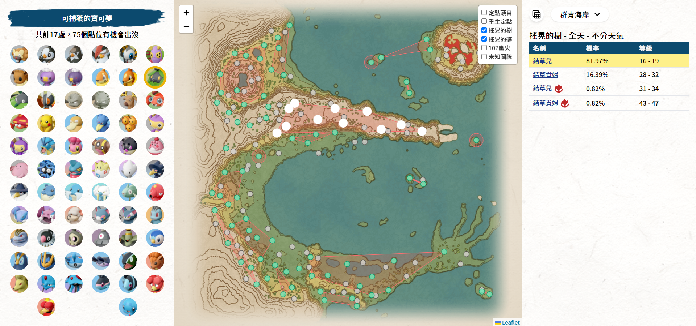
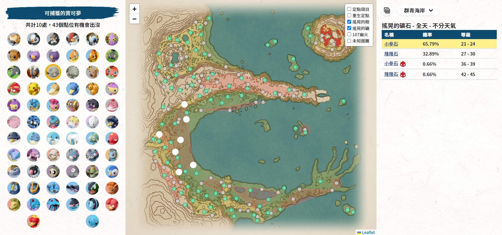
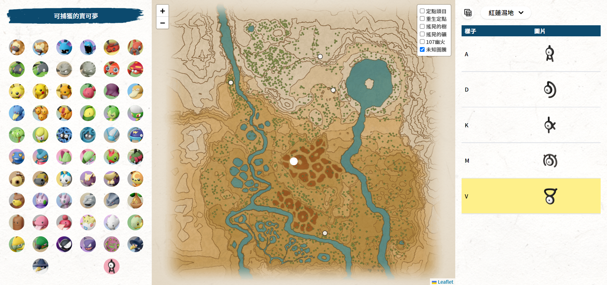
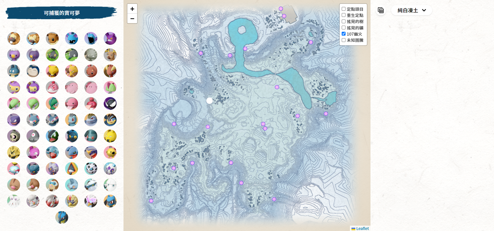

# Pokémon Legends: Arceus

## Pokédex

### Web site: [https://huskyhsu.github.io/arceus/](https://huskyhsu.github.io/arceus/)

#### update

> - `2022-06-03`
>   - 新增時空扭曲、大量出現、大大大量出現、任務中取得資料
>   - (地圖，詳細資料中均有顯示)
>   - 清單頁面新增取得方式過濾器
> - `2022-05-29`
>   - 地圖範圍可捕獲寶可夢
>   - 107 幽火與定點未知圖騰位置
> - `2022-05-13`
>   - 定點頭目分布與重生點地圖

## Pages

- [阿爾宙斯圖鑑索引](#阿爾宙斯圖鑑索引)
- [詳細資料介紹](#詳細資料介紹)
- [地圖索引功能](#地圖索引功能)

## 頁面功能介紹

### 阿爾宙斯圖鑑索引

- 名稱搜尋(中文)
- 屬性快速按鈕
- 區域選單
- 出沒種類(`new feature 2022-06-03`)

### 詳細資料介紹

- 獲得方式
- 掉落道具
- 種族值
- 升等招式
- 傳授招式
- 進化途徑
- 色違、公母圖

### 地圖索引功能

### 支援 RWD

<table>
    <tbody>
        <tr>
            <td></td>
            <td></td>
        </tr>
        <tr>
            <td></td>
            <td></td>
        </tr>
    </tbody>
</table>

## ToDo

- [x] 107 幽火點位
- [x] 大大大量發現
- [x] 地圖小區域標示
- [x] 地圖標示小區域出沒怪
- [ ] 可習得該技能怪清單

### reference

1. [wiki.52poke.com(list)](https://wiki.52poke.com/zh-hant/%E5%AE%9D%E5%8F%AF%E6%A2%A6%E5%88%97%E8%A1%A8%EF%BC%88%E6%8C%89%E6%B4%97%E7%BF%A0%E5%9B%BE%E9%89%B4%E7%BC%96%E5%8F%B7%EF%BC%89)
2. [wiki.52poke.com(move)](https://wiki.52poke.com/zh-hant/%E6%8B%9B%E5%BC%8F%E5%88%97%E8%A1%A8%EF%BC%88%E4%BC%A0%E8%AF%B4_%E9%98%BF%E5%B0%94%E5%AE%99%E6%96%AF%EF%BC%89)
3. [www.serebii.net](https://www.serebii.net/pokearth/hisui/obsidianfieldlands.shtml)
4. [rankedboost.com](https://rankedboost.com/pokemon-legends-arceus/pokedex/)
5. [arceus.gg](https://www.arceus.gg/)
6. [archives.bulbagarden.net](https://archives.bulbagarden.net/wiki/Category:Legends:_Arceus_models)
