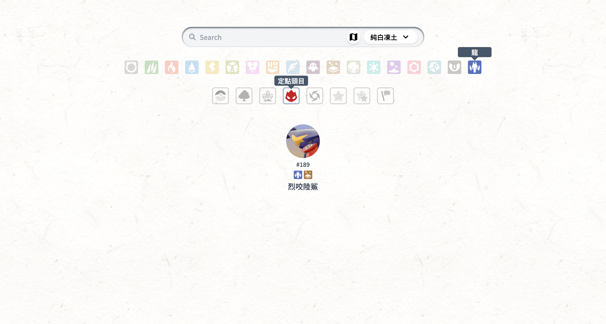
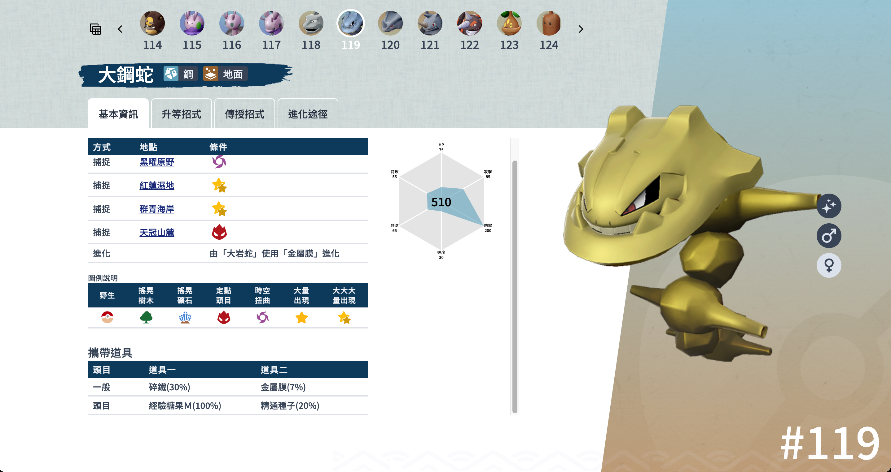
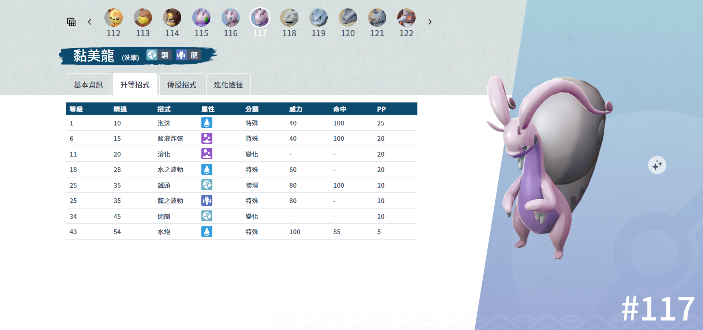
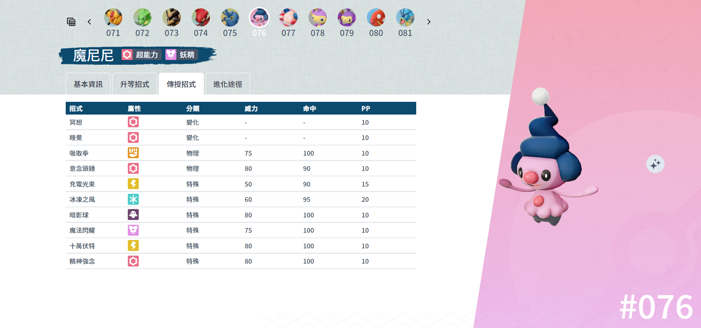
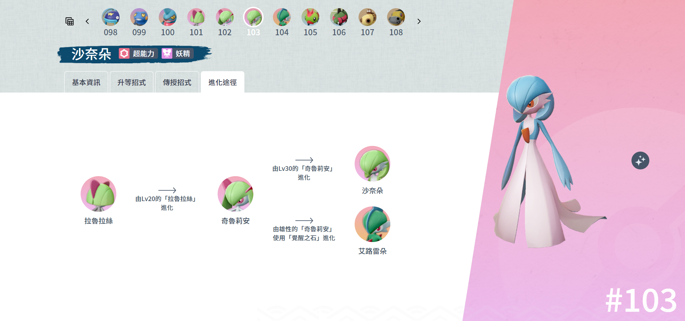
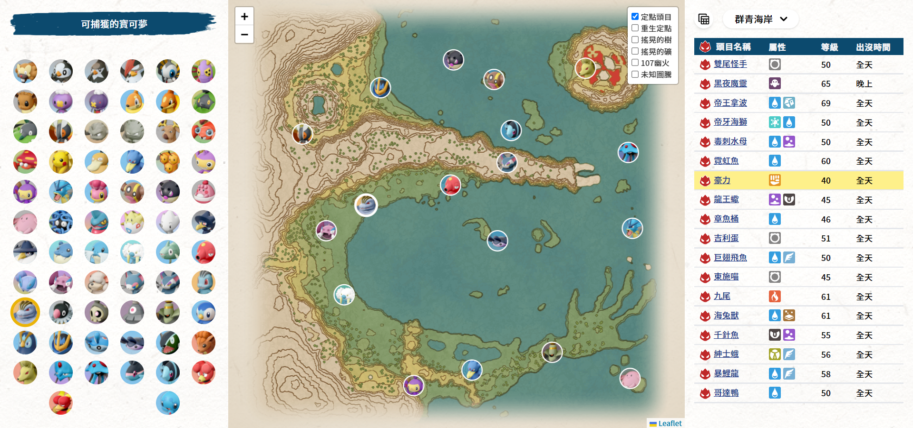
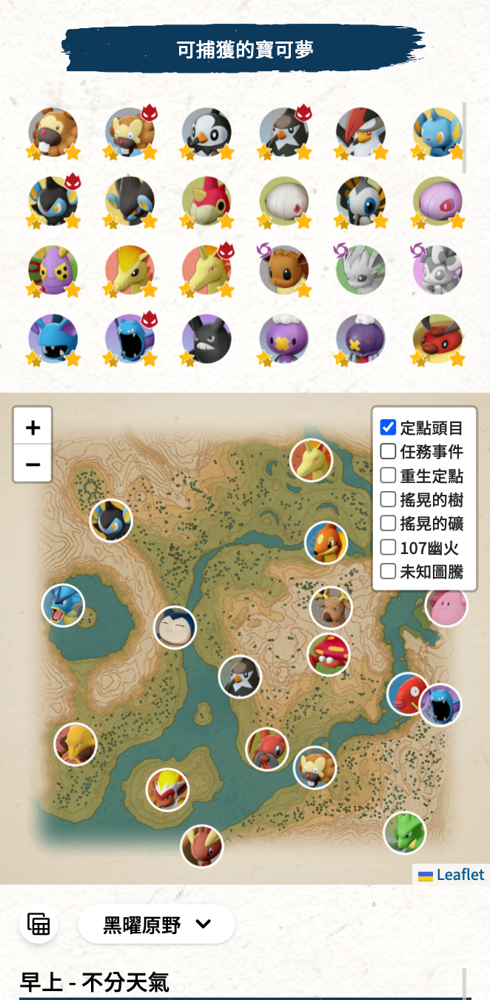
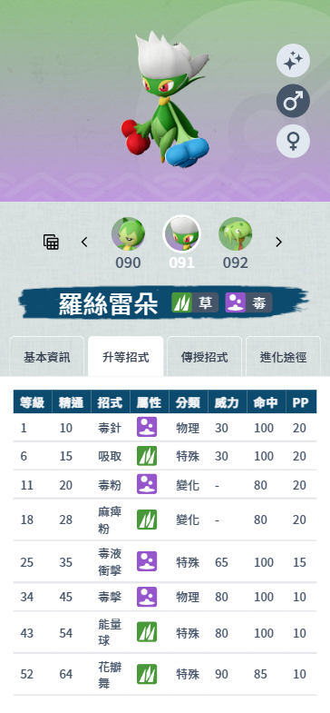
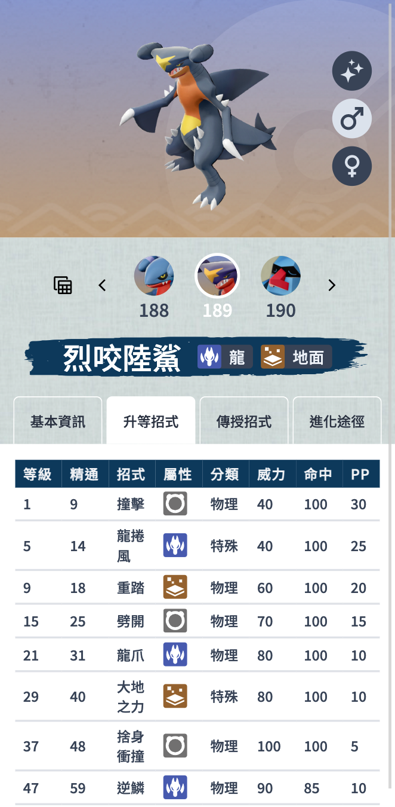

# Pokémon Legends: Arceus

## Pokédex

### Web site: [https://huskyhsu.github.io/arceus/](https://huskyhsu.github.io/arceus/)

## Pages

- [阿爾宙斯圖鑑索引](#阿爾宙斯圖鑑索引)
- [詳細資料介紹](#詳細資料介紹)
- [定點頭目分布地圖](#定點頭目分布地圖)

## 頁面功能介紹

### 阿爾宙斯圖鑑索引

- 名稱搜尋(中文)
- 屬性快速按鈕
- 區域選單

### 詳細資料介紹

- 獲得方式
- 掉落道具
- 種族值
- 升等招式
- 傳授招式
- 進化途徑
- 色違、公母圖

### 定點頭目分布地圖

### 支援 RWD

<table>
    <tbody>
        <tr>
            <td></td>
            <td></td>
        </tr>
        <tr>
            <td></td>
            <td></td>
        </tr>
    </tbody>
</table>

## ToDo

- [ ] 107 幽火點位
- [ ] 大大大量發現
- [ ] 地圖小區域標示
- [ ] 地圖標示小區域出沒怪
- [ ] 可習得該技能怪清單
- [ ] 地圖小區域標示
